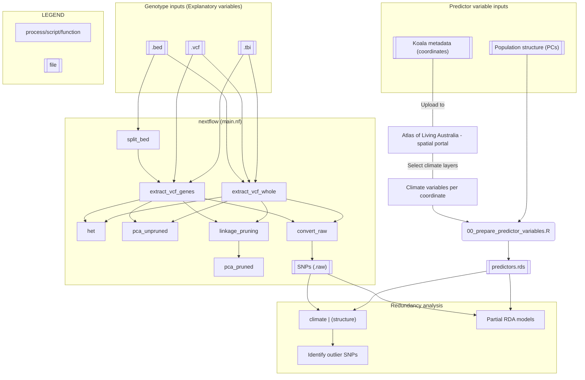

# phasco_genes
Pipeline for investigating genotype-environment associations (GEA) in koala genomes.

## 1. Overview  

This pipeline aims to identify koala loci likely to have adapated to various climate conditions. It largely utilises redundancy analyses (RDA) as described in [Capblancq and Forester (2021)](https://doi.org/10.1111/2041-210X.13722) and [Forester et al. (2018)](https://popgen.nescent.org/2018-03-27_RDA_GEA.html).  

It utilises R, nextflow, and a load of command-line tools to deal with the pre-processing of genome data and climatic variables for RDA.

### 1.1 Workflow  



## 2. Dependencies and Installation  

First, download this repo:  
```
git clone https://github.com/fredjaya/phasco_genes.git
```  

Next, [install miniconda](https://docs.conda.io/en/latest/miniconda.html). There are quite a few dependencies to install, but conda will allow you to download R, nextflow and the command-line tools easily.

Create a conda environment, install the tools using the yaml file, and activate the environment:  
```
conda env create -f env.yml
conda activate phasco-genes
```  

Install R packages:  
```
Rscript bin/install_packages.R
```

## 3. Input data

**Predictor variables**  
1. Climate variables  
2. Population structure  

**Explanatory variables (genotype)**  
3. Whole genome resequencing data `.vcf(.gz)`  
4. Annotation file `.bed`  

### 3.1 Climate variables  


### 1. Preparing the genome data  

input .vcf/gz should be bgzipped and tabixd.

`/data/*` are gene regions of the longest transcript.

### 3. Preparing the annotation file  

Then convert to .bed and retain only CDS regions
```
gff2bed < /data/*.gff | grep -P '\tCDS\t' > /data/*.bed
```

### 3. Preparing environmental variables  

- Upload metadata with lat/longs to Spatial ALA  
- Select layers or upload `data/layerList.csv`  
- Export  
- ???  
- Profit  

## Running the pipeline (nextflow)
paths currently hardcoded in `nextflow.config`
```
nextflow run main.nf
```

## Ideas, to-do, scratch

How are results impacted when conducting GEAs on individual genes (CDS) vs. combined? Also consider whether it's worth splitting .bed file to parallelise extraction.

For now, keep input regions as a single file (replace directory params.bed to single file). single file can be a .bed or .tsv, but needs to be sorted I think.

Input region file must not have overlapping regions, alternate isoforms. For example, this will occur when you have entries for both genes and exons.

Need better version control with conda packages.

Are there any other stats that can/need to be run on the .vcf alone? For example, allele frequencies `vcftools -freq` can be used as the response variable. 

Rscripts to visualise heterozygosity, allele frequency etc. Better yet, generate knitted Rmarkdown report.

Add documentation and usage CLI.

Failed to extract eigenvector(s) from GRM with exonID_MHCI-3-partial. Setting errorStrat for pca_unpruned to ignore cause not important.

When exporting nextflow project - make sure to copy hardlinks. e.g. `rsync -L`

Incorporate .R scripts in nextflow?

Add script for visualising predictor variables? i.e. map with climate variables per sample, climate variable distributions, whole-genome PCA.  

Can't match 2/308 vcf names to koalas in MHC data.

How to deal with missing SNPs in data?  

Add PCA with neutral SNPs
