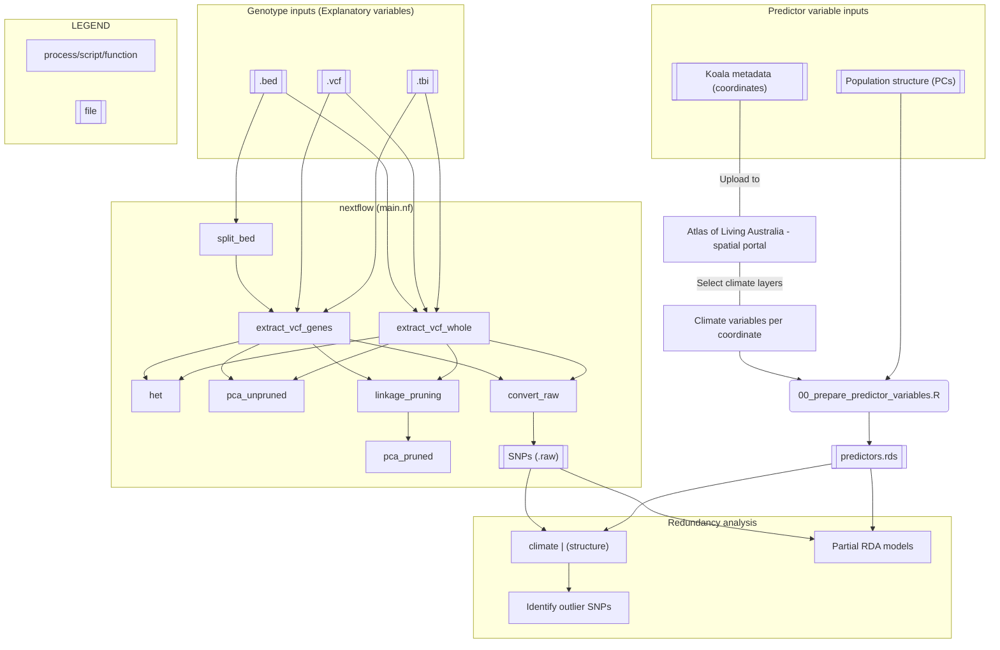

# phasco_genes
Pipeline for investigating genotype-environment associations (GEA) in koala genomes.

## 1. Overview  

This pipeline aims to identify koala loci likely to have adapated to various climate conditions. It largely utilises redundancy analyses (RDA) as described in [Capblancq and Forester (2021)](https://doi.org/10.1111/2041-210X.13722) and [Forester et al. (2018)](https://popgen.nescent.org/2018-03-27_RDA_GEA.html).  

It utilises R, nextflow, and a load of command-line tools to deal with the pre-processing of genome data and climatic variables for RDA.

### 1.1 Workflow  



## 2. Dependencies and Installation  

First, download this repo:  
```
git clone https://github.com/fredjaya/phasco_genes.git
```  

Next, [install miniconda](https://docs.conda.io/en/latest/miniconda.html). There are quite a few dependencies to install, but conda will allow you to download R, nextflow and the command-line tools easily.

Create a conda environment, install the tools using the yaml file, and activate the environment:  
```
conda env create -f env.yml
conda activate phasco-genes
```  

Install R packages:  
```
Rscript bin/install_packages.R
```

## 3. Input data

**Predictor variables**  
1. Climate variables  
2. Population structure  

**Explanatory variables (genotype)**  
3. Whole genome resequencing data `.vcf.gz` and `.tbi`  
4. Annotation file `.bed`  

### 3.1 Climate variables  

For the climate variables, I've opted to use the Atlas of Living Australia (ALA) to avoid having to deal with (downloading) multiple, big rasters from different sources. ALA has a huge selection of spatial layers to select from. A complete list can be found [here](https://spatial.ala.org.au/layers).  

The spatial portal allows you to:  
1. Upload a .csv file containing sample/koala coordinates (latitude, longitude).  
2. Select (multiple) spatial climate data such as temperature, precipitation and so on.  
3. Download the climate data for each coordinate.  

**Uploading coordinate data to ALA**  
`example/metadata_n637.csv` contains the coordinates for all 637 samples koalas.  

Go to the [spatial portal on ALA](https://spatial.ala.org.au/). Create a free account and login.  

Go to `Import` --> `Points` --> `Load File` --> Select `example/metadata_n637.csv` --> Select `Upload file` --> Select `Upload your data`.  

**Selecting and downloading climate data**  
Go to `Export` --> `Points` --> Under `3. Select layers` choose all relevant layers --> `Next >` --> Select `Industry/application` --> `Next >` --> `Download now`  

Alternatively, `example/layerList.csv` contains a list of 10 layers selected according to [Lott et al. (2022)](https://onlinelibrary.wiley.com/doi/abs/10.1111/mec.16446). This file was generated the first time these layers were selected and downloaded. You can upload this file in place of selecting the individuals layers.   

### 3.2 Population structure  

One of the key strengths of RDA is the ability to test for the contribution of confounding factors such as population structure, and geography (i.e. spatial autocorrelation). Currently using Elle's PCA for n = 308 koalas. PCA processes are already implemented but need to be explicitly re-directed into RDA processes.  

### 3.3 Whole genome resequencing data  

For RDAs, the response variable is per-loci genotype data. This can be information such as SNPs, a measure of diversity (heterozygosity), or allele frequencies. Here, we use SNPs in `.vcf.gz` format. This file should contain all individuals you wish to analyse. 

If you have a `.vcf` file, it will need to be compressed using bgzip. Further, all `.vcf.gz` files must have a corresponding index file `.tbi`. The `.tbi` is required by the pipeline for extracting genes out of the `.vcf.gz`. 

The pipeline has been tested using joint-genotyped variants output by Illumina's DRAGEN which outputs these two files in the correct format, but in case you need to compress and index a `.vcf` file:  
```
bgzip -c file.vcf > file.vcf.gz
tabix -p vcf file.vcf.gz
```

### 3.4 Annotation file  

(INCOMPLETE SECTION)

The `.bed` file contains the regions to extract from the genome file.  

Converting .gff to .bed
```
gff2bed < /data/*.gff | grep -P '\tCDS\t' > /data/*.bed
```

## 4. Running the pipeline (nextflow)  

With all input data ready, we can run the pipeline to process the genotype data.  

In summary, nextflow deals with processing the genotype data side of things. It reads in the SNPs and annotations to extract relevant regions, does some pre-processing on them so they're complaint for use with RDAs and R. See flowchart above.  

paths currently hardcoded in `nextflow.config`
```
nextflow run main.nf
```

## Ideas, to-do, scratch (ignore if not Fred)  

How are results impacted when conducting GEAs on individual genes (CDS) vs. combined? Also consider whether it's worth splitting .bed file to parallelise extraction.

For now, keep input regions as a single file (replace directory params.bed to single file). single file can be a .bed or .tsv, but needs to be sorted I think.

Input region file must not have overlapping regions, alternate isoforms. For example, this will occur when you have entries for both genes and exons.

Need better version control with conda packages.

Are there any other stats that can/need to be run on the .vcf alone? For example, allele frequencies `vcftools -freq` can be used as the response variable. 

Rscripts to visualise heterozygosity, allele frequency etc. Better yet, generate knitted Rmarkdown report.

Add documentation and usage CLI.

Failed to extract eigenvector(s) from GRM with exonID_MHCI-3-partial. Setting errorStrat for pca_unpruned to ignore cause not important.

When exporting nextflow project - make sure to copy hardlinks. e.g. `rsync -L`

Incorporate .R scripts in nextflow?

Add script for visualising predictor variables? i.e. map with climate variables per sample, climate variable distributions, whole-genome PCA.  

Can't match 2/308 vcf names to koalas in MHC data.

How to deal with missing SNPs in data?  

Add PCA with **neutral** SNPs

Account for installation and usage on Windows.  

Changed convert_raw to only run on whole vcf, not single genes cause of error on tiny test data.  
