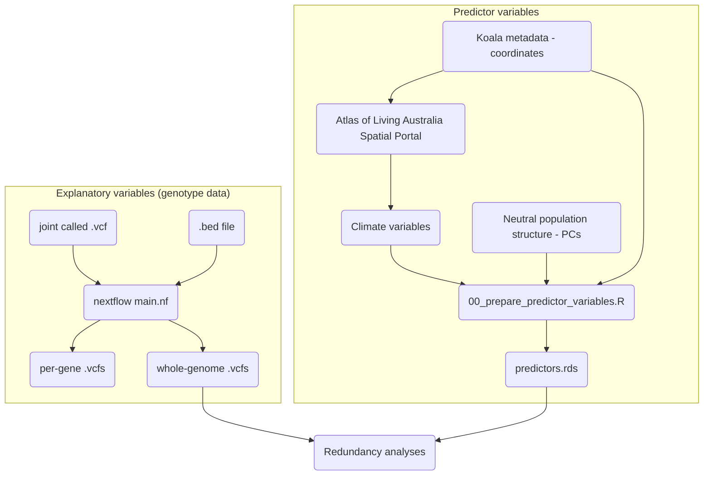

# phasco_genes
Analysis of Koala gene families

## Overview  

*What does this pipeline do?*  

## Dependencies and Installation  

First, download this repo:  
```
git clone https://github.com/fredjaya/phasco_genes.git
```  

This pipeline utilises nextflow, R, and a load of command-line tools. There are quite a few dependencies to install, but conda lets you download them in one go. [install miniconda](https://docs.conda.io/en/latest/miniconda.html).  

Next, create a conda environment and install the command-line tools:  
```
conda env create -f env.yml
conda activate phasco-genes
```  

You will need to manually install several R packages:  
```
bin/install_packages.R
```

## Input data

1. Genome data with all individuals (joint-called) `.vcf(.gz)`  
2. Annotation file of CDS regions to extract `.gff`  
3. Environmental variables i.e. rasters `.tif`  

### 1. Preparing the genome data  

input .vcf/gz should be bgzipped and tabixd.

`/data/*` are gene regions of the longest transcript.

### 3. Preparing the annotation file  

Then convert to .bed and retain only CDS regions
```
gff2bed < /data/*.gff | grep -P '\tCDS\t' > /data/*.bed
```

### 3. Preparing environmental variables  

- Upload metadata with lat/longs to Spatial ALA  
- Select layers or upload `data/layerList.csv`  
- Export  
- ???  
- Profit  

## Running the pipeline (nextflow)
paths currently hardcoded in `nextflow.config`
```
nextflow run main.nf
```

## Flowchart  



## Ideas, to-do, scratch

How are results impacted when conducting GEAs on individual genes (CDS) vs. combined? Also consider whether it's worth splitting .bed file to parallelise extraction.

For now, keep input regions as a single file (replace directory params.bed to single file). single file can be a .bed or .tsv, but needs to be sorted I think.

Input region file must not have overlapping regions, alternate isoforms. For example, this will occur when you have entries for both genes and exons.

Need better version control with conda packages.

Are there any other stats that can/need to be run on the .vcf alone? For example, allele frequencies `vcftools -freq` can be used as the response variable. 

Rscripts to visualise heterozygosity, allele frequency etc. Better yet, generate knitted Rmarkdown report.

Add documentation and usage CLI.

Failed to extract eigenvector(s) from GRM with exonID_MHCI-3-partial. Setting errorStrat for pca_unpruned to ignore cause not amportant.
